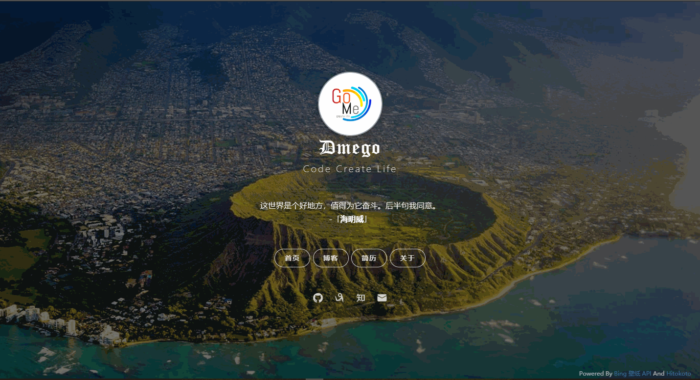

### 个人主页

>这是我的个人主页

>衍生自 [Vno](https://github.com/onevcat/vno-jekyll) Jekyll 主题

>页面部分加载效果借鉴于 [Mno](https://github.com/mcc108/mno) Ghost 主题

>借鉴了[北岛向南的小屋](https://javef.github.io/)的头像样式

### 效果图

>静态图

>动态图

### 注

- 访问地址：[个人主页](http://i.dmego.me/)
- 使用了 [一言](http://hitokoto.cn/) 的 API 服务
- ~~使用了 [Bing 壁纸 API](https://github.com/xCss/bing/) 服务~~
- ~~使用了 [Yahoo Query Language (YQL)](https://developer.yahoo.com/yql/) 来解决获取 Bing 壁纸跨域问题~~
- 原先 YQL 服务将被淘汰，现改用 [JsonBird](https://bird.ioliu.cn/)

### 更新时间

>2019-7-7
